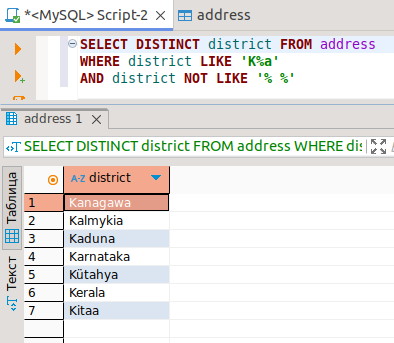
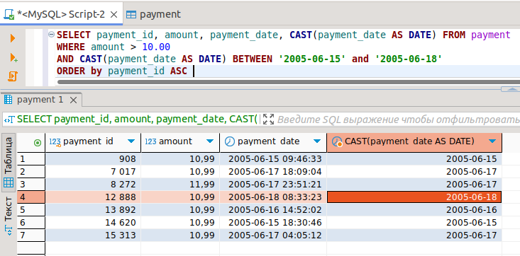
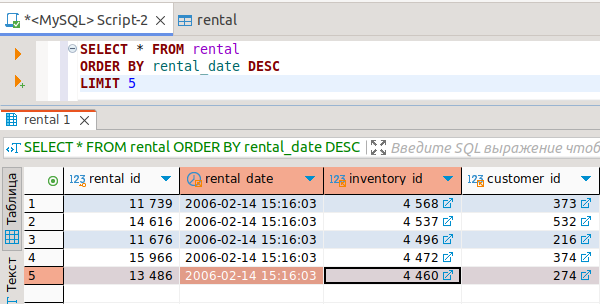
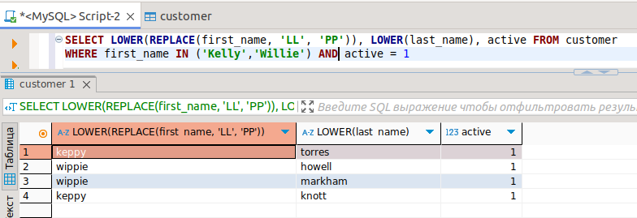

# Домашнее задание к занятию «SQL. Часть 1» - 'Жаринов Павел'
---
### Задание 1

Получите уникальные названия районов из таблицы с адресами, которые начинаются на “K” и заканчиваются на “a” и не содержат пробелов.

```
SELECT DISTINCT district FROM address
WHERE district LIKE 'K%a' 
AND district NOT LIKE '% %'
```


### Задание 2

Получите из таблицы платежей за прокат фильмов информацию по платежам, которые выполнялись в промежуток с 15 июня 2005 года по 18 июня 2005 года **включительно** и стоимость которых превышает 10.00.
```
SELECT payment_id, amount, payment_date, CAST(payment_date AS DATE) FROM payment
WHERE amount > 10.00
AND CAST(payment_date AS DATE) BETWEEN '2005-06-15' and '2005-06-18'
ORDER by payment_id ASC
```


### Задание 3

Получите последние пять аренд фильмов.
```
SELECT * FROM rental
ORDER BY rental_date DESC
LIMIT 5
```


### Задание 4

Одним запросом получите активных покупателей, имена которых Kelly или Willie. 

Сформируйте вывод в результат таким образом:
- все буквы в фамилии и имени из верхнего регистра переведите в нижний регистр,
- замените буквы 'll' в именах на 'pp'.
```
SELECT LOWER(REPLACE(first_name, 'LL', 'PP')), LOWER(last_name), active FROM customer
WHERE first_name IN ('Kelly','Willie') AND active = 1
```

